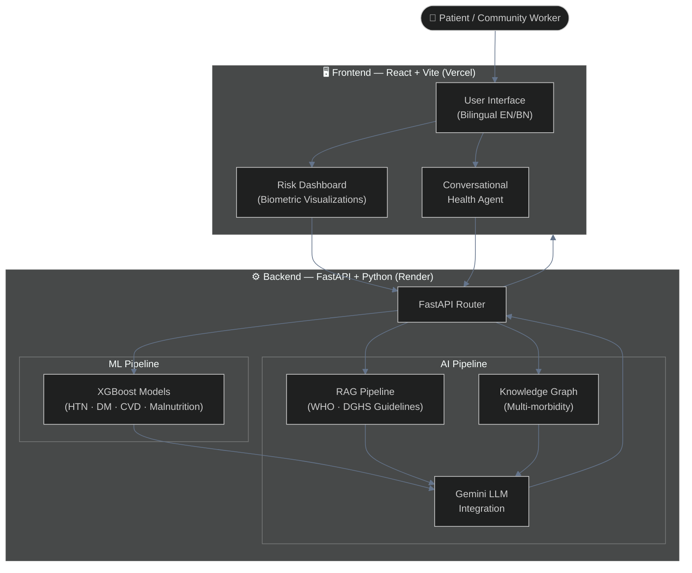
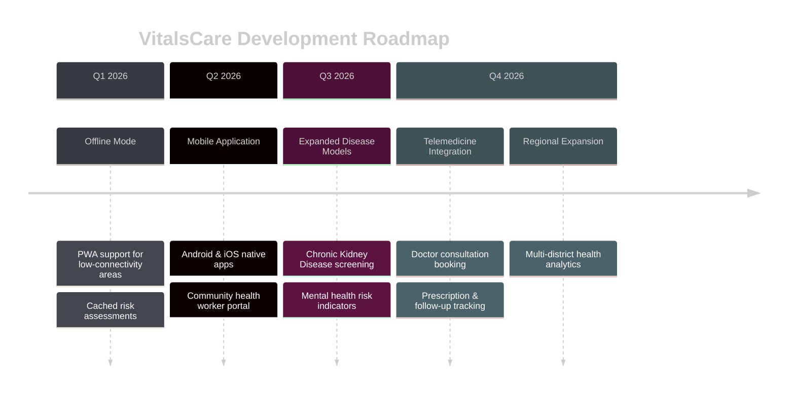

<div align="center">

# VitalsCare
### *Screen it. Know it. Act on it.*

[](https://react.dev/)
[](https://vitejs.dev/)
[](https://fastapi.tiangolo.com/)
[](https://www.python.org/)
[](LICENSE)

<p align="center">
  <strong>An AI-Powered Community Health Risk Radar</strong><br>
  <em>A HealthTech platform for non-communicable disease screening in rural and underserved communities</em>
</p>

---

</div>

## 🆕 Recent Updates
- **API Data Validation**: Implemented strict input validation on the backend `/assess` endpoint to reject biologically impossible data (e.g., Age 0, BMI 0) via HTTP 400 errors.
- **ML Data Mapping Fix**: Fixed a dataset parsing bug in `ml_models.py` where "Prehypertension" text wasn't mapped, causing the model to ignore blood pressure. The model is now highly accurate (98.3%) and properly weighs current vitals.
- **UI & PDF Risk Reconciliation**: Updated the React Dashboard (`RiskDashboard.tsx`) and PDF Generator (`pdfGenerator.ts`) to directly rely on the ML-calculated risk probabilities for color coding (Low/Medium/High Risk), ensuring the UI always accurately reflects the AI's assessment.

## 📖 Introduction

Access to early health screening remains out of reach for millions in **rural and underserved communities**. **VitalsCare** addresses this gap by combining machine learning, knowledge graphs, and large language models into a single, accessible platform that delivers **localized, culturally-aware health risk assessments** and actionable clinical insights.

### 🎯 Key Objectives

| Objective | Description |
|-----------|-------------|
| 🩺 **NCD Screening** | Early detection of Hypertension, Diabetes, CVD, and Malnutrition |
| 🌐 **Bilingual Access** | English & Bengali interface for community-level reach |
| 🤖 **AI-Driven Insights** | ML + LLM pipeline for personalized recommendations |
| 🔗 **Knowledge Graph Reasoning** | Multi-morbidity interaction detection |

---

## 🚀 Key Features

<table>
<tr>
<td width="50%">

### 🧠 ML Risk Prediction
- **XGBoost Pipeline**
  - Hypertension risk scoring
  - Diabetes risk scoring
  - Cardiovascular Disease (CVD) risk
  - Malnutrition risk assessment
- Trained on **real-world clinical datasets**

</td>
<td width="50%">

### 💬 AI Health Agent
- **RAG Pipeline**
  - WHO clinical guideline integration
  - Bangladesh DGHS protocol integration
- **Gemini LLM**
  - Personalized, empathetic recommendations
  - Context-aware response synthesis

</td>
</tr>
<tr>
<td width="50%">

### 📊 Risk Dashboards
- Dynamic biometric visualizations
- Real-time conversational Health Agent
- Bilingual (English & Bengali) UI
- Mobile-responsive design

</td>
<td width="50%">

### 🔗 Knowledge Graph
- Multi-morbidity interaction detection
- Comorbidity risk reasoning
- Structured clinical relationship mapping
- Graph-based inference engine

</td>
</tr>
</table>

---

## 🏗 System Architecture



---

## 💻 Tech Stack

<div align="center">

| Category | Technologies |
|:--------:|:-------------|
| **Language** | Python 3, JavaScript (ES2022+) |
| **Frontend** | React, Vite, CSS Modules |
| **Backend** | FastAPI, Uvicorn |
| **ML / AI** | XGBoost, LangChain (RAG), NetworkX (Knowledge Graph) |
| **LLM** | Google Gemini API |
| **Deployment** | Vercel (Frontend), Render (Backend) |
| **Tools** | Git, VS Code, Postman |

</div>

### Technical Highlights

- 🤖 **ML Pipeline**: XGBoost models trained on clinical datasets for four NCD risk categories.
- 📚 **RAG Pipeline**: Retrieval-Augmented Generation grounded in WHO and Bangladesh DGHS guidelines.
- 🔗 **Knowledge Graph**: Graph-based reasoning engine for detecting multi-morbidity interactions.
- 💡 **LLM Synthesis**: Gemini Cloud LLM generates personalized, empathetic patient-facing recommendations.
- 🌍 **Bilingual UI**: Full English and Bengali language support for community-level accessibility.

---

## 📥 Installation & Setup

### Prerequisites

- 🟢 **Node.js** v18+ and npm
- 🐍 **Python** 3.9+
- 🔑 **Gemini API Key** (set in backend `.env`)

### Quick Start

```bash
# 1. Clone the repository
git clone https://github.com/your-org/VitalsCare.git

# 2. Navigate to the project directory
cd VitalsCare

# 3. Start both frontend and backend concurrently
./shell.sh
```

### Running Individually

```bash
# Backend (FastAPI)
cd backend
pip install -r requirements.txt
uvicorn main:app --reload

# Frontend (React + Vite)
cd frontend
npm install
npm run dev
```

### Configuration

Create a `.env` file in the `backend/` directory:

```env
GEMINI_API_KEY=your_api_key_here
```

The frontend is pre-configured to point to the deployed Render backend, so no additional setup is needed for standard use.

---

## 📁 Project Structure

```
VitalsCare/
├── 📂 frontend/                # React/Vite UI application
│   ├── 📂 src/
│   │   ├── 📂 components/      # Reusable UI components
│   │   ├── 📂 pages/           # Route-level page components
│   │   ├── 📂 hooks/           # Custom React hooks
│   │   └── 📂 assets/          # Static assets & styles
│   └── 📄 vite.config.js
├── 📂 backend/                 # FastAPI ML & AI services
│   ├── 📄 main.py              # Application entry point
│   ├── 📂 routers/             # API route handlers
│   ├── 📂 models/              # ML model files (.pkl / .json)
│   ├── 📂 rag/                 # RAG pipeline & vector store
│   ├── 📂 knowledge_graph/     # Graph reasoning engine
│   └── 📄 requirements.txt
├── 📄 shell.sh                 # Start both servers locally
├── 📄 run_and_push.sh          # Commit, push & start servers
└── 📄 README.md
```

---

## 🔮 Future Roadmap



### Planned Features

- [ ] 📱 **Mobile Application** - Android/iOS native apps for community health workers
- [ ] 📡 **Offline Mode** - PWA support for low-connectivity rural areas
- [ ] 🩺 **Expanded Models** - CKD, mental health, and respiratory disease screening
- [ ] 📹 **Telemedicine** - Doctor consultation booking and follow-up tracking
- [ ] 📊 **Health Analytics** - Aggregated regional and district-level health dashboards

---

## ⚠️ Clinical Disclaimer

> **VitalsCare is a prototype designed for research and screening awareness purposes only.** It is **not** a substitute for professional medical advice, diagnosis, or treatment. Always seek the advice of a physician or other qualified health provider with any questions you may have regarding a medical condition.

---

## 📄 License

This project is licensed under the MIT License. See the [LICENSE](LICENSE) file for details.

---

<div align="center">

**⭐ Star this repository if you found it helpful!**

**VitalsCare** — *Bringing preventive healthcare to every community*

</div>